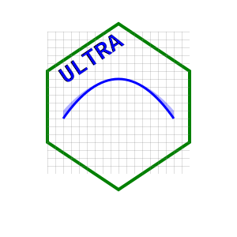

# ultra 


<!-- badges: start -->
<!-- badges: end -->
<div class="nowrap">
ULTRA (Univariate Logistic Tandem Regression Algorithm) is a method for feature selection and prediction model fitting when the number of observations are low compared to the number of features (p &gt;&gt; n), and the outcome is binary.
</div>

## Installation

From GitHub:

``` r
devtools::install_github("joemb1/ultra")
```

## Example

This is a basic example which shows you how to solve a common problem:

``` r
library(ultra)
## basic example code
```


